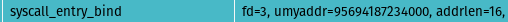
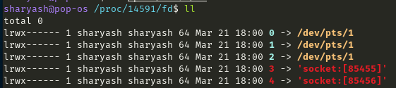
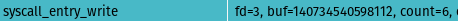
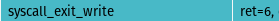
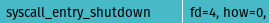

## Objective :bulb:
The main goal of this project is to delve into the mechanics of the netcat utility and its interaction with the Linux kernel. By tracing the execution path within the kernel, I aim to gain a deeper understanding of how netcat operates at a low level.

## What is netcat ? 
netcat (often abbreviated to nc) is a computer networking utility for reading from and writing to network connections using TCP or UDP. 

## Tools :wrench:
- nc : The 'nc' command, also known as Netcat, can be used to establish a simple network connection. This can be particularly useful for testing network connectivity or transferring small amounts of data.
- lttng version 2.13.10 - Nordicité : LTTng (Linux Trace Toolkit: next generation) is a system software package for correlated tracing of the Linux kernel, applications and libraries. The project was originated by Mathieu Desnoyers with an initial release in 2005. Its predecessor is the Linux Trace Toolkit.
- Trace Compass 9.2.0 : Eclipse Trace Compass is an open source application to solve performance and reliability issues by reading and analyzing traces logs. Its goal is to provide views, graphs, metrics, and more to help extract useful information from traces, in a way that is more user-friendly and informative than huge text dumps.
- wireshark : Wireshark is a free and open-source packet analyzer. It is used for network troubleshooting, analysis, software and communications protocol development, and education.

## Trace Overview :chart_with_upwards_trend:

1. Set up netcat server and client.
2. Trace packet communication with Wireshark.
3. Capture system calls using LTTng and analyze with TraceCompass.

## Setup & Configuration :page_facing_up:
- Prior to launching the nc server and client, I configured Wireshark to trace packets specifically on ports 4000 and 4444, designating port 4000 for the server and port 4444 for the client. This will involve setting up a filter on the loopback interface to capture any packets with tcp.srcport matching the specified ports, facilitating detailed analysis during the subsequent initialization of nc. This can be achieve by using the below filter : 
`tcp.srcport == 4000 || tcp.srcport == 4444`
- After configuring Wireshark, I execute the LTTng script I've prepared to initiate the LTTng session for tracing. The script enables all system call events and additional kernel events related to scheduling, networking, and state dumping, while also adding virtual thread ID, virtual process ID, process name, and priority as context. The script's purpose is to comprehensively capture kernel-level activity during the experiment.

## Experiment explanation
To commence the experiment, I initiate the netcat server on port 4000 and the client on port 4444 using the commands `nc -l 127.0.0.1 4000` and `nc -p 4444 127.0.0.1 4000` respectively. The process can be visualized in trace compass, as illustrated in the image provided.

#### How is a TCP connection actually established ?
Before we uncover the details of read, write, and poll syscalls, let's start by understanding how the socket is allocated to this process. This marks the stage where the socket is set up, configured, and readied for connections, thanks to the orchestration of socket(), setsockopt(), bind(), listen(), and accept().\
\
Now, let's explore the specifics of each of these functions.
##### socket
\
socket() creates an endpoint for communication and returns a file descriptor that refers to that endpoint. 
- family ( domain ) : The  domain  argument  specifies a communication domain; this selects the protocol family which will be used for communication. According to `<sys/socket.h>` file, family 2 corresponds to AF_INET, which represents the Internet Protocol version 4 (IPv4) address family.
- type : The  socket has the indicated type, which specifies the communication semantics . Since it's a TCP connection, the type of socket is set to stream rather than datagram. ( type = SOCK_STREAM )
- protocol :  The protocol specifies a particular protocol to be used with the socket. According to /etc/protocols , protocol = 6 means TCP 

\
The file descriptor returned by a successful call will be the lowest-numbered file descriptor not currently open for the process which in this case it equals to 3. 

##### setsockopt
\
setsockopt() set options on specific socket 
- fd : the file descriptor which in this case it equals to the returned value of socket()
- level : When manipulating socket options, the level at which the option resides and the name of the  option  must  be specified . To manipulate options at the sockets API level, level is specified as `SOL_SOCKET` . `SOL_SOCKET` is the socket layer itself and is used for options that are protocol independent. ( level=1 means `SOL_SOCKET` according to `<sys/socket.h>`)
- optname :  Optname and any specified options are passed uninterpreted to the appropriate protocol module for interpretation. based on `<sys/socket.h>` the optname=2 specify the `SO_REUSEADDR` option which indicates that the rules used in validating addresses supplied in a bind(2) call should allow reuse of local addresses. For `AF_INET` sockets this means that a socket may bind, except when there is  an  active  listening  socket bound to the address.  When the listening socket is bound to INADDR_ANY with a specific port then it is not possible to bind to this port for any local address.  Argument is an  in‐
teger boolean flag. `SO_REUSEADDR` is most commonly set in network server programs, since a common usage pattern is to make a configuration change, then be required to restart that program to make the change take effect. Without `SO_REUSEADDR`, the `bind()` call in the restarted program's new instance will fail if there were connections open to the previous instance when you killed it. Those connections will hold the TCP port in the `TIME_WAIT` state for 30-120 seconds, so you fall into case 1 above. ( check [What is SO_REUSEADDR](https://stackoverflow.com/questions/3229860/what-is-the-meaning-of-so-reuseaddr-setsockopt-option-linux) for more information ) 
- optval and optlen : The arguments optval and optlen are used to access option values for  setsockopt(). The optval and optlen parameters are used to pass data used by the particular set command. The optval parameter points to a buffer containing the data needed by the set command. The optlen parameter must be set to the size of the data pointed to by optval.

\
On success, zero is returned for the standard options.

###### Note : 

\
In the images provided, you can see that `setsockopt()` is called twice. The first call as I mentioned earlier configures the `SO_REUSEADDR` option, and the second one sets the `SO_REUSEPORT` option Since the optname equals to 15. For more information about how `SO_REUSEADDR`,`SO_REUSEPORT` and `BSD socket implementation` works check the following link (The most comprehensive explanation I've come across) :
[How do SO_REUSEADDR and SO_REUSEPORT differ](https://stackoverflow.com/questions/14388706/how-do-so-reuseaddr-and-so-reuseport-differ)

Let's break down the `SO_REUSEPORT` into a quick overview based on the above link : 
- SO_REUSEPORT allows you to bind an arbitrary number of sockets to exactly the same source address and port as long as all prior bound sockets also had SO_REUSEPORT set before they were bound. If the first socket that is bound to an address and port does not have SO_REUSEPORT set, no other socket can be bound to exactly the same address and port, regardless if this other socket has SO_REUSEPORT set or not, until the first socket releases its binding again. ( in BSD socket implementation )
- To prevent "port hijacking" : All sockets that want to share the same address and port combination must belong to processes that share the same effective user ID . So one user cannot "steal" ports of another user .
- For UDP sockets, it tries to distribute datagrams evenly, for TCP listening sockets, it tries to distribute incoming connect requests (those accepted by calling accept()) evenly across all the sockets that share the same address and port combination. Thus an application can easily open the same port in multiple child processes and then use SO_REUSEPORT to get a very inexpensive load balancing.

##### bind
When  a  socket  is created with socket(2), it exists in a name space (address family) but has no address as signed to it.  bind() assigns the address specified by addr to the socket referred to by the file  descriptor sockfd.   addrlen  specifies the size, in bytes, of the address structure pointed to by addr.  Traditionally, this operation is called “assigning a name to a socket\
\
On success, zero is returned.\

##### listen 
\
listen()  marks  the socket referred to by sockfd as a passive socket, that is, as a socket that will be used to accept incoming connection requests using accept(2).
- The fd(sockfd) argument is a file descriptor that refers to a socket of type `SOCK_STREAM` or `SOCK_SEQPACKET`
- The backlog argument defines the maximum length to which the queue of  pending  connections  for  sockfd  may grow.   If a connection request arrives when the queue is full, the client may receive an error with an indication of `ECONNREFUSED` or, if the underlying protocol supports retransmission, the request may be ignored so that a later reattempt at connection succeeds.

On success, zero is returned.\

##### accept ( accept4 )
\
The  accept()  system  call is used with connection-based socket types (`SOCK_STREAM`, `SOCK_SEQPACKET`).  It extracts the first connection request on the queue of pending connections for  the  listening  socket,  sockfd, creates  a  new connected socket, and returns a new file descriptor referring to that socket.  The newly created socket is not in the listening state.
- The argument sockfd is a socket that has been created with socket(2), bound to a local address with  bind(2), and is listening for connections after a listen(2). ( in this case fd=3 )
- The  argument addr is a pointer to a sockaddr structure.  This structure is filled in with the address of the peer socket, as known to the communications layer.
- The addrlen argument is a value-result argument: the caller must initialize it to contain the size (in bytes) of the structure pointed to by addr
- flags=0x800 Sets the O_NONBLOCK file status flag on the new open file description.

###### Note :
If no pending connections are present on the queue, and the socket is not  marked  as  nonblocking,  accept() blocks  the caller until a connection is present.  If the socket is marked nonblocking and no pending connections are present on the queue, accept() fails with the error `EAGAIN` or `EWOULDBLOCK`.
In order to be notified of incoming connections on a socket, you can use select(2), poll(2), or epoll(7). A readable  event  will be delivered when a new connection is attempted and you may then call accept() to get a socket for that connection.

Alos its important to know that `SOCK_NONBLOCK` just sets the newly accepted socket to non-blocking. It does not make accept itself non-blocking. For this one would need to set the listen socket non-blocking before calling accept. That's why we have these two states after accept4\
\

On  success, these system calls return a file descriptor for the accepted socket (a nonnegative integer) . In this case it's fd=4 
Also notice the peer v4addr and sport ( 127.0.0.1:4444 ) which is our nc client on port 4444\
\
we can validate this by using `lsof` command to show the open files of nc process 
- find the pid of nc prcess ( also we can check this in trace compass) In control flow of trace compass\
\
Or using ps command \

- Then by using lsof command to

also we can check the fd (file descriptor ) of specific process in /etc/[pid]/fd as it mentioned below : 

Note that the time when the connection was established ( syscall_exit_accept4 ) matches the time which is shown in the wireshark 
- trace compass\

- wireshark\

What we saw earlier is all the things behind the scene of establishing a tcp connection from the server side , but the question is that what happened in the client side ( what events and syscall occured in the client side to establish this connection ) ? 

##### connect

The connect() system call connects the socket referred to by the file descriptor sockfd to the address specified by addr.  The addrlen argument specifies the size of addr. ( Also notice the peer v4addr and dport - 127.0.0.1:4000 - which is our nc server)

nc server ( first line ) accept the connect request of nc client ( second line ) . See the earlier wireshark screenshot to find out the relation between the connect syscall and SYN packet . It means that the nc server actually `accept()` this `connect()` request. 

#### How does netcat actually work ?

First, we will describe each of the poll, read, and write system calls.
##### poll
poll() performs a similar task to select(2): it waits for one of a set of file descriptors to become ready to perform I/O. On success, poll() returns a nonnegative value which is the number of elements in the pollfds  whose  revents fields  have been set to a nonzero value (indicating an event or an error).  A return value of zero indicates that the system call timed out before any file descriptors became read. 

##### read 
read() attempts to read up to `count` bytes from file descriptor `fd` into the buffer starting at `buf`. On success, the number of bytes read is returned (zero indicates end of file), and the file position is advanced by this number.

##### write
write() writes up to `count` bytes from the buffer starting at `buf` to the file referred to by the file descriptor `fd`. On success, the number of bytes written is returned.

##### Client side : 
- poll : which waits untill I type something ( which in this case I typed "salam" )
\
timeout_msecs=-1 Which according to the documentation, specifies the number of milliseconds that poll() should block waiting for a file descriptor to become ready and specifying a negative value ( like here which is -1 ) means an infinite timeout and the call will block until either a file descriptor becomes ready or the call is interrupted by a signal handler .\

- read : nc client reads from the `STDIN` file descriptor ( which I typed "salam")\
\
The count field is 16384 which sets the upper bound for this read syscall ( 16384 bytes = 16 Kibibyte )\
\
ret is equal to 6 since "salam" with \n at the end is 6 bytes .
- poll : again waits to perform I/O on the selected fds . 
- write : writes to fd=3 socket ( the socket that a tcp connection established on that in the client side )\
\
again the count field sets to 6 since "salam" with \n at the end is 6 bytes .\
\
we can see that ret is also equal to 6.
##### Server side : 
- poll : which waits untill an event occured on fds .
- read : it reads from the fd=4 ( the socket that a tcp connection established on that in the server side )\
\
It's obvious that the return value must be equal to 6 . \

- poll : again waits to perform I/O on the selected fds . 
- write : write what was read from the fd=4 socket to `STDOUT`\
\

#### How is the TCP connection being closed ? 
After read() the EOF from the socket ( according to the documentation , the return value of read syscall is 0 when it reads EOF) , the following syscalls occured . 
##### shutdown 
The  shutdown()  call  causes  all or part of a full-duplex connection on the socket associated with sockfd to be shut down.  If how is `SHUT_RD`, further receptions will be disallowed.  If how is  `SHUT_WR`, further transmissions will be disallowed.  If how is `SHUT_RDWR`, further receptions and transmissions will be disallowed.\

- fd=4 ( the socket that a tcp connection established on that in the server side )
- how=0 which according to file.c of kernel source code is `SHUT_RD`

\
On success, zero is returned.

##### close
close()  closes  a file descriptor, so that it no longer refers to any file and may be reused.\
\
On success, zero is returned.\

Note that the time when the connection was being closed matches the time which is shown in the wireshark 
- trace compass\

- wireshark\

