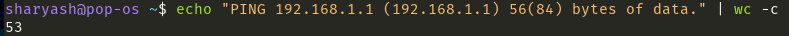
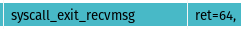

## Objective :bulb:
In this mini project, we'll analyze kernel-level responses to pinging the default gateway, manipulating parameters like packet size and interval to observe their effects on timeouts and network behavior.

## What is ping ? 
ping uses the ICMP protocol's mandatory ECHO_REQUEST datagram to elicit an ICMP ECHO_RESPONSE from a host or gateway. ECHO_REQUEST datagrams (“pings”) have an IP and ICMP header, followed by a struct timeval and then an arbitrary number of “pad” bytes used to fill out the packet.

## Experiment Explanation
below syscalls occured when ping my default gateway :
- socket
    socket() creates an endpoint for communication and returns a file descriptor that refers to that endpoint.\
    
    - family ( domain ) : The  domain  argument  specifies a communication domain; this selects the protocol family which will be used for communication. According to `<sys/socket.h>` file, family 2 corresponds to AF_INET, which represents the Internet Protocol version 4 (IPv4) address family.
    - type : The  socket has the indicated type, which specifies the communication semantics . According to net.h file of linux source code type=2 means SOCK_DGRAM
    - protocol :  The protocol specifies a particular protocol to be used with the socket. According to /etc/protocols , protocol = 1 means ICMP 

- socket
    
    - family=10 : According to `<sys/socket.h>` file, family 10 corresponds to AF_INET6, which represents the Internet Protocol version 6 (IPv6) address family.
    - type=2 means SOCK_DGRAM
    - protocol=58 . According to /etc/protocols , it's ipv6-icmp ( ICMP for IPv6)

- socket
    
    - family=2 : corresponds to AF_INET
    - type=2 : it means SOCK_DGRAM
    - protocol=0 : According to /etc/protocols , it's IP ( internet protocol )

- connect
    
    - fd=5
    - v4addr=192.168.1.1 which is my default gateway
    - dport=1025 , but why 1025 ?! If you check the source code of iputils , you can see that they hardcoded the 1025 dest port which is actually a trick to get current source IP that ping program used . The use of 1025 is in the condition of no source ip specified. If we specify the source IP, there is no connect in the trace log .

- setsockopt
    
    - level=0 and optname=11 : According to socket.h , it's `SO_NO_CHECK` which is used for UDP checksum control . Linux kernel calculates checksum value of all received udp packets and if calculated checksum not equal with the checksum in packet, kernel drops entire packet (according to RFC1122) and adds an entry to kernel log. By using `SO_NO_CHECK` , we can disable UDP checksum control . 

- write : It writes "PING 192.168.1.1 (192.168.1.1) 56(84) bytes of data." into `SDTOUT` ( its 53 bytes as you can see )
    
    

- There are some setsockopt syscalls that set some additional options such as SO_SNDTIMEO_OLD and SO_RCVTIMEO_OLD which are useful for setting the timeout for send and recieve packets . 

- Then there are sendto and recvmsg pairs which shows the ICMP echo request and its response\
\
as you can see the len=64 since the default packet size is 64 byte .\
\
Also note that the response size is also 64 bytes ( as it expected )

A change on packet size leads to different len value in sendto/recvmsg syscalls and a change on interval ends up to more/less difference between two consecutive sento syscalls  .

What happened if we use flood ping instead of normal one ? 
For every `ECHO_REQUEST` sent a period “.” is printed, while for every `ECHO_REPLY` received a backspace is printed. This provides a rapid display of how many packets are being dropped. If interval is not given, it sets interval to zero and outputs packets as fast as they come back or one hundred times per second, whichever is more. ( write syscall in `STDOUT` )

What happened if set the packet size to some high value like 64KB (ping -s 65507) ? 
The recvmsg() return -11 ( `EAGAIN` ). According to the documentation , it happens when a receive timeout ( using setsockopt `SO_RCVTIMEO_OLD` ) had  been set and the timeout expired before data was received.