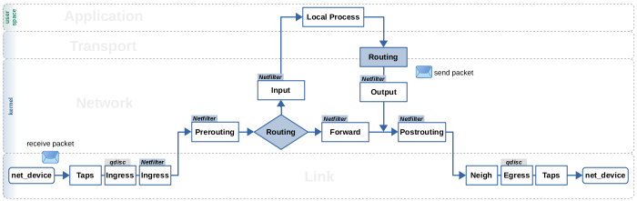
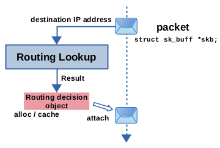
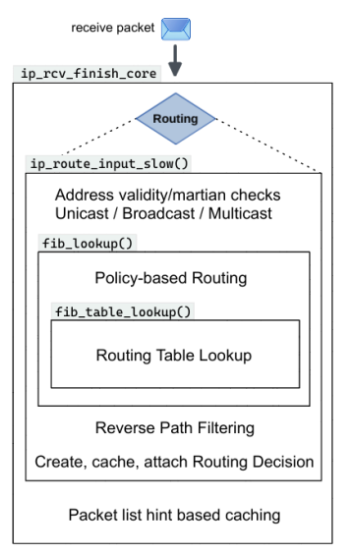
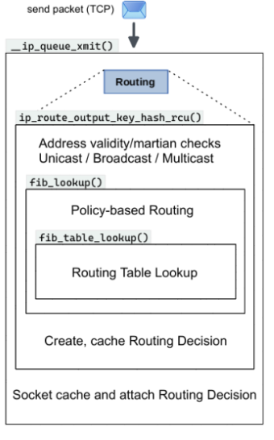
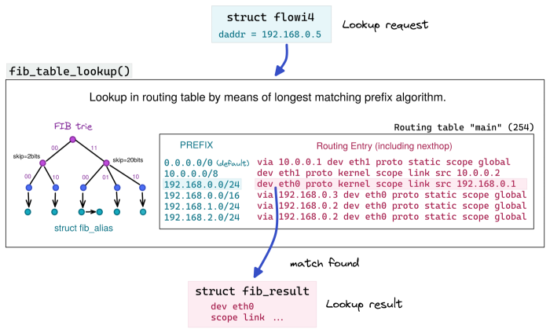
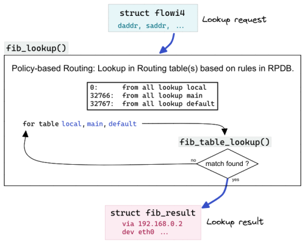

###### Note : This article is situated within the broader discourse initiated by [Routing Decision in the Linux kernel](https://thermalcircle.de/doku.php?id=blog:linux:routing_decisions_in_the_linux_kernel_1_lookup_packet_flow).

A lookup into the routing table(s) is part of network layer handling of IP packets in the kernel. Based on the destination IP address of the packet, the lookup tries to find a best matching routing entry and thereby determines what to do with the packet. Figure 1 represents a simplified block diagram of the packet flow through the kernel and shows the two most relevant places where the routing lookup is performed. Other items like the Netfilter hooks are shown as well to provide some orientation

As you can see, the routing lookup is performed for frames received on the network, once they are identified as IP packets, reached network layer and traversed the Netfilter Prerouting hook. It determines whether those packets are to be handed to transport layer to be received by a local socket or whether they are to be forwarded and then sent out again on the network. The routing lookup is further performed for locally generated packets coming from the transport layer, to determine whether there is a route for these packets to be sent out on the network. For forwarded as well as local outgoing packets the routing lookup determines the output network interface and the next hop gateway IP address, if existing. But how is the decision made by the lookup actually being applied to a network packet? Well, ***it is being attached to the packet.*** More precise, it is attached to the socket buffer (skb) representing the packet. Resulting from the routing lookup, an object representing the routing decision is allocated or taken from cache and then attached to the network packet (skb) as shown in Figure 2. This object contains necessary data like output interface and next hop gateway IP address. It further contains function pointers, which lay out the path that packet takes through the remaining part of the kernel network stack. The focus of this article is on this attached “routing decision”. It is often also referred to as the “destination cache”.


#### The Routing Lookup
 In the receive path of IPv4 packets, shown in below figure , the routing lookup is done within function ```ip_rcv_finish_core()```. This function calls ```ip_route_input_noref()```, which is an intermediate function, not shown in Figure 3. Several calls deeper into the call stack, ```ip_route_input_slow()``` is called, which performs several checks before and also after the actual lookup, which is done within function ```fib_lookup()```, and also takes care about creating, caching and attaching the resulting routing decision to the network packet.


The complete flow is actually more complex that the above statements : 
Actually it first tries to find a suitable destination structure in the route cache and if that fails it invokes the above functions . 
- if route cache hit : set skb->dst to this entry
- if route cache miss : 
    - if the destination is a multicast address ,  it is necessary to determine  whether the
interface on which this packet was received belongs to this multicast group. If the the destination was a multicast address and the interface was a member of the associated
group and several configuration constraints are met, then the packet is sent to ```ip_route_input_mc()``` for routing. 
        ```c
            if (ipv4_is_multicast(daddr)) {
                struct in_device *in_dev = __in_dev_get_rcu(dev);
                int our = 0;
                int err = -EINVAL;

                if (!in_dev)
                    return err;
                our = ip_check_mc_rcu(in_dev, daddr, saddr,
                            ip_hdr(skb)->protocol);

                /* check l3 master if no match yet */
                if (!our && netif_is_l3_slave(dev)) {
                    struct in_device *l3_in_dev;

                    l3_in_dev = __in_dev_get_rcu(skb->dev);
                    if (l3_in_dev)
                        our = ip_check_mc_rcu(l3_in_dev, daddr, saddr,
                                    ip_hdr(skb)->protocol);
                }

                if (our
        #ifdef CONFIG_IP_MROUTE
                    ||
                    (!ipv4_is_local_multicast(daddr) &&
                    IN_DEV_MFORWARD(in_dev))
        #endif
                ) {
                    err = ip_route_input_mc(skb, daddr, saddr,
                                tos, dev, our);
                }
                return err;
            }
        ```
    - else : Reaching this point implies the packet was routeable neither through the routing cache nor as a multicast.  The  ```ip_route_input_slow()``` function must be called to try to route via the FIB
        ```c
        return ip_route_input_slow(skb, daddr, saddr, tos, dev, res);
        ```

In the local output path of an already established TCP connection, shown in below figure , the routing lookup is done within function ```__ip_queue_xmit()```. This function calls ```ip_route_output_ports()```, which is an intermediate function. Several calls deeper into the call stack, function i```p_route_output_key_hash_rcu()``` is called, which performs several checks before and also after the actual lookup, which is done within function ```fib_lookup()```, and also takes care about creating and caching the resulting routing decision. However, attaching that routing decision to the network packet is not done here in this case, but instead in the outer function ```__ip_queue_xmit()```. As you can see, both the receive path and the local output path got function ``fib_lookup()`` in common. This function takes care about policy-based routing. Finally… a few more functions further down the call stack, function ```fib_table_lookup()``` is called, which contains the routing lookup algorithm, and thus performs the actual lookup into a routing table. In the following sections I'll explain the lookup from the inside out; thus, starting with the innermost function ```fib_table_lookup()```.
- The term FIB stands for forwarding information base, which is a more generic term for routing tables and MAC tables.


#### fib_table_lookup
Function ```fib_table_lookup()``` performs the actual routing table lookup, more precisely the lookup into one single routing table. As systems usually got several routing tables, the code calling this function needs to specify which routing table shall be consulted. In the most common case this of course is the main routing table, which is the one that is shown when you enter command ip route without further arguments. Function ```fib_table_lookup()``` needs to be fed with an instance of struct flowi4. This instance represents the “question” or “request” you like to give to the routing subsystem. The struct contains several member variables. However, the only one relevant for function ```fib_table_lookup()``` in practice is member ```daddr```, which holds the IP address for which the lookup shall be performed. If the lookup finds a match, then the function spits out an instance of ```struct fib_result```, which – as the name suggests – represents the lookup result. If no match is found, an error code is returned. This can e.g. happen, if no routing entry matches and no default route 0.0.0.0/0 is specified within that routing table, which else would function as a “catch all” match.


```c
int fib_table_lookup(struct fib_table *tb, const struct flowi4 *flp,
    struct fib_result *res, int fib_flags)
```

#### fib_lookup
Routing policy database (RPDB) is a set of rules to be evaluated before the actual routing lookup. These rules specify which routing table(s) to consult in which case. This way, more packet characteristics than just the destination IP address can be taken into account when doing the routing lookup. These can be things like the source IP address, skb->mark, TCP/UDP source/destination port, and so on. This is why struct flowi4 has several member variables. While the lower layer function fib_table_lookup() mostly only cares about member daddr, the PBR implementation in function fib_lookup(), depending on the set of rules, makes use of the other ones. For example, a rule can specify to consult a different routing table for packets with a specific source IP address.

