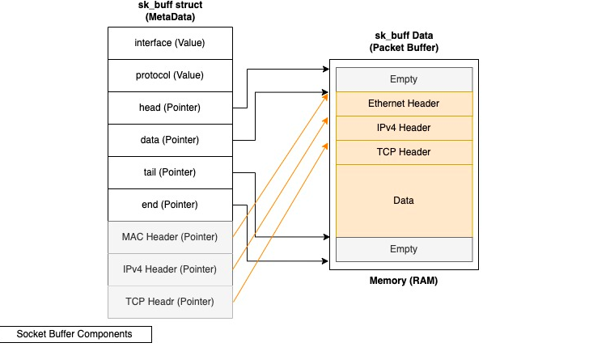
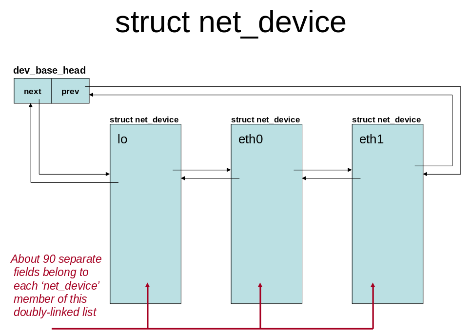
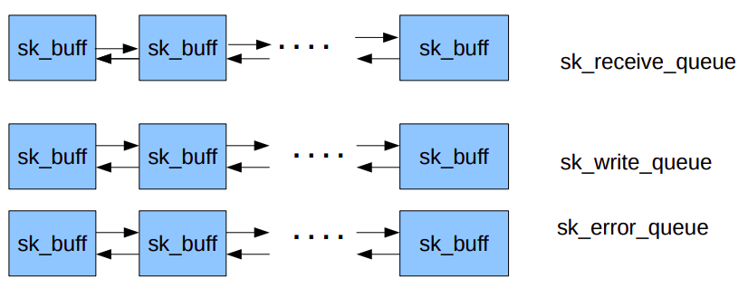
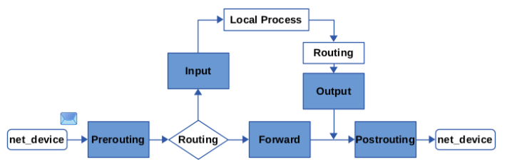
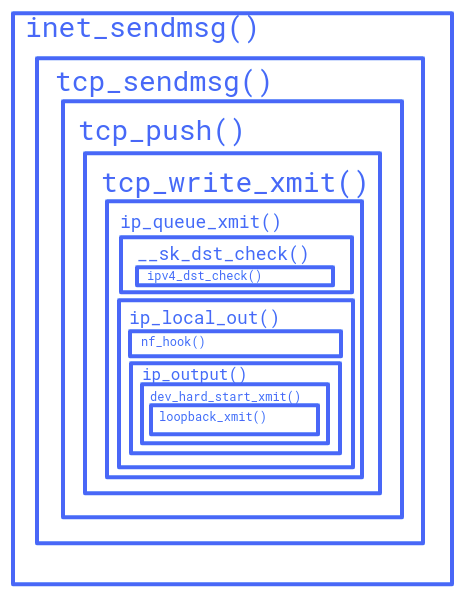

### Kernel Network Stack Code Inspection 

In this article we will go over the details of the kernel TCP/IP network stack code and answer the following question : 

- What is sk_buff struct in linux kernel code ? 
- what is sock struct ? 
- Explain how TCP handles an incoming SYN request
- What are the APIs between layers ( L2/IP, IP/Transport, Transport/Application )
- How is ping received?
- What is the role of interrupts in receiving a packet? Where is the boundary between the
interrupt handler and the rest of kernel code when a new packet is received?
- Where and how is memory allocated for an arriving packet?

So let delve into it : 

##### What is sk_buff struct ? 
The buffers used by kernel to manage network packets are referred to as sk_buffs in Linux. (Their
BSD counterparts are referred to as mbufs).  The buffers are always allocated as at least two separate
components: a fixed size header of type struct ```sk_buff```; and a variable length area large enough to hold all or part of the data of a single packet. 

- Note : ```sk_buff``` is the main networking structure representing a packet which is a metadata structure and does not hold any packet data. All the data is held in associated buffers as I described before .



```c
	union {
		struct {
			/* These two members must be first to match sk_buff_head. */
			struct sk_buff		*next;
			struct sk_buff		*prev;

			union {
				struct net_device	*dev;
				/* Some protocols might use this space to store information,
				 * while device pointer would be NULL.
				 * UDP receive path is one user.
				 */
				unsigned long		dev_scratch;
			};
		};
		struct rb_node		rbnode; /* used in netem, ip4 defrag, and tcp stack */
		struct list_head	list;
		struct llist_node	ll_node;
	};
```
 The sk_buff elements are organized as a doubly linked list, in such a way that it is very efficient to move an sk_buff element from the beginning/end of a list to the beginning/end of another list so 
- ```struct sk_buff *next``` is a pointer to next buffer in list 
- ```struct sk_buff *prev``` is a pointer to previous buffer in list

The ```net_device``` structure in the Linux kernel code is a fundamental component of the network driver layer which plays a crucial role in representing network devices and interfaces.


- ```struct net_device *dev``` points to the network device associated with the packet. 

 The `list_head` structure consists of two pointers, next and prev, which point to the next and previous elements in the list, respectively. 
 ```c
 struct list_head {
	struct list_head *next, *prev;
};
 ```
- ```struct list_head	list``` is used to organize the sk_buff structures into a doubly linked list. This list is used in various networking subsystems, such as packet queues, to efficiently manage and manipulate the packets.

```c
union {
		struct sock		*sk;
		int			ip_defrag_offset;
};
```
- ```struct sock *sk``` points to the socket associated with the packet. ( for more information : [sock struct]( #what-is-sock-struct ))
```c
union {
    ktime_t		tstamp;
    u64		skb_mstamp_ns; /* earliest departure time */
};
```
- The `tstamp` member is of type `ktime_t` and is used to record the timestamp for the packet, either when it arrived or when it was sent. The timestamp is recorded if necessary, such as for packet sniffers or certain socket options.
- The `skb_mstamp_ns` member is of type u64 and is used to store the earliest departure time for the packet.

```c
unsigned int		len,
				data_len;
	__u16			mac_len,
				hdr_len;
```
- len: Length of actual data
- data_len: Data length
- mac_len: Length of link layer header
- hdr_len: writable header length of cloned skb

```c
	__u16			inner_transport_header;
	__u16			inner_network_header;
	__u16			inner_mac_header;

	__be16			protocol;
	__u16			transport_header;
	__u16			network_header;
	__u16			mac_header;
```
- protocol: Packet protocol from driver
- inner_transport_header: Inner transport layer header (encapsulation)
- inner_network_header: Network layer header (encapsulation)
- inner_mac_header: Link layer header (encapsulation)
- transport_header: Transport layer header
- network_header: Network layer header
- mac_header: Link layer header


##### What is sock struct ? 
In order to understand the sock struct , we must first find out what is sk_buff_head struct : 
###### what is sk_buff_head struct ? 
```c
struct sk_buff_head {
	/* These two members must be first to match sk_buff. */
	struct_group_tagged(sk_buff_list, list,
		struct sk_buff	*next;
		struct sk_buff	*prev;
	);

	__u32		qlen;
	spinlock_t	lock;
};
```
Every sk_buff structure in the doubly linked list must be able to find the head of whole list quickly. that's the purpose of sk_buff_head structure, which is inserted at the beginning of the list. so, sk_buff_head is a special sk_buff.


- `qlen` in the `sk_buff_head` structure is a variable of type `__u32` that represents the length of the queue of socket buffers (`sk_buff`). It stores the number of socket buffers in the queue, which is used to manage the flow of network packets within the kernel's networking stack . 

So now that we find out what sk_buff_head is lets dive into the definiton of sock struct : 
struct sock or INET socket in Linux terminology is the network representation of a socket.
###### Note : How it differents from socket struct ? 
struct socket is an abstraction very close to user space, ie BSD sockets used to program network applications but sock struct is network layer abstraction of socket . 

struct sock has three main queues : rx, tx and error 


which we can see in the code : 
```c
struct sk_buff_head	sk_error_queue;
struct sk_buff_head	sk_receive_queue;
struct sk_buff_head	sk_write_queue;
```
###### What is dst_entry struct ? 
struct `dst_entry` is the inner struct of the routing decision object attached to a network packet. It is sometimes referred to as the destination cache. Variables of this type are often named dst. Most relevant member variables are:
- ```struct net_device *dev```: Pointer to the output network interface, on which this packet shall be sent out (relevant of forwarded and outgoing packets). This has been specified by the matching routing entry.
- ```struct xfrm_state *xfrm```: Reference to an IPsec SA. In a normal situation this is NULL. However, in case you are using IPsec and a lookup into the IPsec SPD (Security Policy Database) has been performed, then, in case this network packet matches an IPsec policy, the routing decision object is replaced by a whole “bundle” of structs referencing each other. In that case, member xfrm points to the IPsec SA which is to be applied to this packet. You'll find details on that in my blog article Nftables - Netfilter and VPN/IPsec packet flow.
-  when a packet is received locally, the dst_entry structure will point to a route that indicates the packet is destined for the local system. When a packet is transmitted, the dst_entry structure will point to a route that indicates the next hop for the packet in the network. `int (*input)(struct sk_buff *skb)` and `int (*output)(struct net *net, struct sock *sk, struct sk_buff *skb)` : 

To understand the flow of routing lookup : Read [Lookup Flow](https://github.com/sharyash81/kernel-tracing/tree/main/routing)

```c
struct dst_entry __rcu	*sk_rx_dst
struct dst_entry __rcu	*sk_dst_cache
```
- ```struct dst_entry __rcu	*sk_rx_dst```: is used for locally received packets
- ```struct dst_entry __rcu	*sk_dst_cache```: is used for outgoing packets. 

###### What is sock_common struct ? 
This is the minimal network layer representation of sockets, the header for struct `sock` and struct `inet_timewait_sock`.

```c
union {
		__addrpair	skc_addrpair;
		struct {
			__be32	skc_daddr;
			__be32	skc_rcv_saddr;
		};
	};
```
The skc_addrpair field is a structure that contains two IP addresses, while the skc_daddr and skc_rcv_saddr fields are individual IP addresses. These fields are used to store the destination IP address of the packet and the source IP address of the interface that received the packet, respectively.

```c
union {
		__portpair	skc_portpair;
		struct {
			__be16	skc_dport;
			__u16	skc_num;
		};
	};
```
same here for port .

```c
unsigned short		skc_family;
volatile unsigned char	skc_state;
unsigned char		skc_reuse:4;
unsigned char		skc_reuseport:1;
```
The `skc_family` field in the sock_common structure is used to store the address family of the socket. The `skc_state` field is used to store the state of the socket, such as whether it is open or closed. The `skc_reuse` field is used to store the reuse flag for the socket, which determines whether the socket can be reused when it is already in use. The `skc_reuseport` field is used to store the reuse port flag for the socket, which determines whether the socket can be reused for multiple binds to the same port. ( more information [Reuse vs Reuseport](https://stackoverflow.com/questions/14388706/how-do-so-reuseaddr-and-so-reuseport-differ))

###### What is proto struct ? 
The struct proto in the sock struct in the Linux kernel is used to define a new protocol. It is a structure that contains function pointers for various socket operations, such as accept, bind, setsockopt, and getsockopt. The struct proto is used to define the behavior of a specific protocol, such as TCP or UDP, and is used in conjunction with the struct sock structure to represent a socket in the kernel. The struct proto is used to define the protocol-specific behavior of the socket,
```c
struct proto		*skc_prot;
```

```c
u16			sk_type;
u16			sk_protocol;
```
The sk_type field stores the type of the socket, such as `SOCK_STREAM`, while the sk_protocol field stores the protocol associated with the socket


###### What is socket struct ? 
The struct socket in Linux is a higher-level interface used for system calls and represents a general BSD socket. It contains a pointer to the struct file which represents a file descriptor, and a pointer to the struct sock which is an in-kernel implementation for AF_INET sockets
```c
struct socket		*sk_socket;
```

##### How TCP handles an incoming SYN request ? 

```c
int ip_rcv(struct sk_buff *skb, struct net_device *dev, struct packet_type *pt,
	   struct net_device *orig_dev)
{
	struct net *net = dev_net(dev);

	skb = ip_rcv_core(skb, net);
	if (skb == NULL)
		return NET_RX_DROP;

	return NF_HOOK(NFPROTO_IPV4, NF_INET_PRE_ROUTING,
		       net, NULL, skb, dev, NULL,
		       ip_rcv_finish);
}
```

###### ip_rcv_core()
```c
static struct sk_buff *ip_rcv_core(struct sk_buff *skb, struct net *net)
```
It is responsible for verifying the validity of the IP packet and performing various checks and operations on it.  One of the key things that ip_rcv_core() does is check the IP header checksum to ensure that the packet has not been corrupted during transmission. If the checksum check fails, the function will drop the packet

Here are some of the drop_reason that mentioned in the code : 
- `SKB_DROP_REASON_OTHERHOST` : is s a drop reason used in the Linux kernel to indicate that a packet does not belong to the current host because the interface is in promiscuous mode. 
    ```c
        /* When the interface is in promisc. mode, drop all the crap
        * that it receives, do not try to analyse it.
        */
        if (skb->pkt_type == PACKET_OTHERHOST) {
            dev_core_stats_rx_otherhost_dropped_inc(skb->dev);
            drop_reason = SKB_DROP_REASON_OTHERHOST;
            goto drop;
        }
    ```
- `SKB_DROP_REASON_PKT_TOO_SMALL` : is a drop reason used in the Linux kernel to indicate that a packet has been dropped because its size is too small
    ```c

        len = iph_totlen(skb, iph);
        if (skb->len < len) {
            drop_reason = SKB_DROP_REASON_PKT_TOO_SMALL;
            __IP_INC_STATS(net, IPSTATS_MIB_INTRUNCATEDPKTS);
            goto drop;
        } 
    ```
- `SKB_DROP_REASON_IP_CSUM` : 
It indicate that the IP checksum of a packet is incorrect, which suggests that the packet has been corrupted during transmission
- `SKB_DROP_REASON_IP_INHDR` :  is used in the Linux kernel's network stack to indicate that there is something wrong with the IP header of a packet. 
    ```c
        if (!pskb_may_pull(skb, iph->ihl*4))
            goto inhdr_error;

        iph = ip_hdr(skb);

        if (unlikely(ip_fast_csum((u8 *)iph, iph->ihl)))
            goto csum_error;

        len = iph_totlen(skb, iph);
        if (skb->len < len) {
            drop_reason = SKB_DROP_REASON_PKT_TOO_SMALL;
            __IP_INC_STATS(net, IPSTATS_MIB_INTRUNCATEDPKTS);
            goto drop;
        } else if (len < (iph->ihl*4))
            goto inhdr_error;
    ```
    ```c
    csum_error:
        drop_reason = SKB_DROP_REASON_IP_CSUM;
        __IP_INC_STATS(net, IPSTATS_MIB_CSUMERRORS);
    inhdr_error:
        if (drop_reason == SKB_DROP_REASON_NOT_SPECIFIED)
            drop_reason = SKB_DROP_REASON_IP_INHDR;
        __IP_INC_STATS(net, IPSTATS_MIB_INHDRERRORS);
    ```
After the validation check , The `NF_HOOK` macro is used to invoke the `nf_hook` function with the appropriate arguments. In the `ip_rcv()` function, the `NF_HOOK` macro is used to trigger the `NF_INET_PRE_ROUTING` hook, which is called right after a packet is received on a network card, before the routing decision is made. The ip_rcv_finish function is passed as the last argument and is used to continue processing the packet after it has passed through the hook functions.

```c
return NF_HOOK(NFPROTO_IPV4, NF_INET_PRE_ROUTING,
		       net, NULL, skb, dev, NULL,
		       ip_rcv_finish);
```

###### NF_HOOK(), nf_hook() and nf_hook_slow()
The `nf_hook` function is a part of the Netfilter framework in the Linux kernel. It is responsible for processing incoming packets based on the hook function that is registered with it. 
The `nf_hook` function checks if there are any hooks filters set for the specified protocol family and hook number. If there are, it invokes the `nf_hook_slow` function to process the packet. If there are no hooks filters set or if the cond argument is 0, the function returns 1, indicating that the packet should be passed to the next hook function.
The `nf_hook_slow()` function is defined in net/core/netfilter.c, it's task is to invoke each hook in the specified list, and based on the verdict from the hooks,  the appropriate action is taken. In summary the return values mean the following to the `NF_HOOK`  macro:
- Negative: packet was dropped
- Zero: packet was queued or stolen so nothing more to do.
- One: the packet was not dropped, queued, stolen.  The NF_HOOK macro invokes  the OK function directly

###### tcp_v4_rcv()
First , it do the chehksum validation : 
```c
if (skb_checksum_init(skb, IPPROTO_TCP, inet_compute_pseudo))
		goto csum_error;
```
which calls 
```c
static inline __sum16 __skb_checksum_validate_complete(struct sk_buff *skb,
						       bool complete,
						       __wsum psum)
{
	if (skb->ip_summed == CHECKSUM_COMPLETE) {
		if (!csum_fold(csum_add(psum, skb->csum))) {
			skb->csum_valid = 1;
			return 0;
		}
	}

	skb->csum = psum;

	if (complete || skb->len <= CHECKSUM_BREAK) {
		__sum16 csum;

		csum = __skb_checksum_complete(skb);
		skb->csum_valid = !csum;
		return csum;
	}

	return 0;
}
```
This function do the actuall checksum validation with the help of ``csum_fold`` function : 
```c
static inline __sum16 csum_fold(__wsum csum)
{
	u32 sum = (__force u32)csum;
	sum = (sum & 0xffff) + (sum >> 16);
	sum = (sum & 0xffff) + (sum >> 16);
	return (__force __sum16)~sum;
}
```

```c 
csum_error:
		drop_reason = SKB_DROP_REASON_TCP_CSUM;
		trace_tcp_bad_csum(skb);
		__TCP_INC_STATS(net, TCP_MIB_CSUMERRORS);
```

after that , if the state of the socket is TCP_LISTEN , it calls the 
function `tcp_v4_do_rcv` :
```c
	if (sk->sk_state == TCP_LISTEN) {
		ret = tcp_v4_do_rcv(sk, skb);
		goto put_and_return;
	}
``` 
In the TCP_LISTEN case : 
```c
if (sk->sk_state == TCP_LISTEN) {
		struct sock *nsk = tcp_v4_cookie_check(sk, skb);

		if (!nsk)
			goto discard;
		if (nsk != sk) {
			if (tcp_child_process(sk, nsk, skb)) {
				rsk = nsk;
				goto reset;
			}
			return 0;
		}
	} 
```
It performs the coockie check and if it succeeded , it calls the ```tcp_child_process``` which calls  ```tcp_rcv_state_process```function in deeper levels and if the socket is in `TCP_LISTEN` state : 
```c
case TCP_LISTEN:
		if (th->ack)
			return 1;

		if (th->rst) {
			SKB_DR_SET(reason, TCP_RESET);
			goto discard;
		}
		if (th->syn) {
			if (th->fin) {
				SKB_DR_SET(reason, TCP_FLAGS);
				goto discard;
			}
			/* It is possible that we process SYN packets from backlog,
			 * so we need to make sure to disable BH and RCU right there.
			 */
			rcu_read_lock();
			local_bh_disable();
			acceptable = icsk->icsk_af_ops->conn_request(sk, skb) >= 0;
			local_bh_enable();
			rcu_read_unlock();

			if (!acceptable)
				return 1;
			consume_skb(skb);
			return 0;
		}
		SKB_DR_SET(reason, TCP_FLAGS);
		goto discard;
```
`tcp_conn_request` is responsible for processing incoming SYN packets and establishing a new TCP connection . 

##### What are the APIs between layers ( L2/IP, IP/Transport, Transport/Application ) ? 


The above image shows how exactly the packet that want to transmit from our loopback interface , passes through each layer of TCP/IP stack : 
###### inet_sendmsg()
This function is a generic function provided by the AF_INET protocol family in the Linux kernel. It is responsible for sending data over IPv4 sockets using the Internet Protocol (IP).

###### tcp_sendmsg()
This is an intermediate function which calls `tcp_sendmsg_locked` which do several chceks like check if the app that wants to transmit the packet , has any limited ( rate limited )

###### tcp_push()
Intermediate functino which calls `tcp_write_xmit()`

###### tcp_write_xmit()
This routine writes packets to the network and its responsible for transmitting TCP data packets.

###### ip_queue_xmit()
It is responsible for sending IP packets. It first check whether it can route this packet or not using `__sk_dst_check` function which return `dst_entry` struct .

###### ip_local_out()
It is responsible for sending IP packets to their destination when the packet is destined for the local system. The function performs several operations, such as setting the length of the IP packet, computing the checksum, and calling the netfilter hook `nf_hook` for any additional processing.

###### ip_output() and dev_hard_start_xmit()
It calls `dev_hard_start_xmit` which 
is called with a socket buffer (SKB) containing the packet data, as well as a pointer to the network device that the packet should be sent on. The function checks if the network device is ready to transmit the packet, and if so, it calls the `xmit_one` function to transmit the packet. If the network device is not ready to transmit the packet, the `dev_hard_start_xmit` function returns a value indicating that the packet should be queued for later transmission.

###### loopback_xmit()
It is responsible for handling the transmission of packets through the loopback interface

##### How is ping received?

###### icmp_rcv()
its deals with incoming ICMP packets which first check an incoming packet against the IPsec policies configured on the system in `xfrm4_policy_check`.
then it validate the checksum using `skb_checksum_simple_validate` and if it fails it set the `skb_drop_reason reason` to `SKB_DROP_REASON_ICMP_CSUM` and if its ok and the type of icmp packet is `ICMP_EXT_ECHOREPLY` it calls the `ping_rcv()` function:

###### ping_rcv()
The function attempts to retrieve the socket associated with the incoming packet. If no socket is found, the function returns the `SKB_DROP_REASON_NO_SOCKET` value, indicating that the packet should be dropped. If a socket is found, The function creates a clone of the incoming packet using the skb_clone function. If the clone is successful, the function calls the `__ping_queue_rcv_skb` function to process the cloned packet. If the `__ping_queue_rcv_skb` function returns an error, the reason variable is set to `SKB_DROP_REASON_NOMEM`, indicating that the packet should be dropped due to a lack of memory.

##### What is the role of interrupts in receiving a packet? Where is the boundary between the interrupt handler and the rest of kernel code when a new packet is received?

```
__do_softirq() {
    net_rx_action() {
    __napi_poll() {
        process_backlog() {
```

###### do_softirq
It handles the execution of softirqs, which are low-level interrupt handlers that run in the kernel context. 
###### net_rx_action
is a specific softirq handler that is responsible for handling network receive interrupts. It is responsible for processing incoming network packets and passing them up the network stack for further processing.
###### napi_poll
I completely explain the napi_poll function in [what is napi](https://github.com/sharyash81/kernel-tracing/tree/main/telnet#what-is-napi-and-how-does-it-improve-the-the-performance-of-packet-processing-) documentation

###### process_backlog
It is a loop that runs until its weight has been consumed or until each piece of data on the backlog queue has been removed and passed on to `__netif_receive_skb` ( the rest of kernel code )


##### Where and how is memory allocated for an arriving packet?
```c
struct sk_buff *alloc_skb(unsigned int len, int priority);
struct sk_buff *dev_alloc_skb(unsigned int len);
```
The `alloc_skb()` function is used by network drivers to allocate a buffer for storing network data packets .
It allocates a buffer and initializes both `skb->data` and `skb->tail` to `skb->head`. The `dev_alloc_skb` function is a shortcut that calls `alloc_skb` with `GFP_ATOMIC` priority and reserves some space between `skb->head` and `skb->data`. This data space is used for optimizations within the network layer and should not be touched by the driver.
