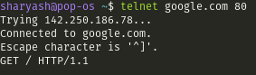

## Objective :bulb:
The primary objective of this project is to explore the inner workings of Telnet, specifically at the kernel level. Our aim is to gain a thorough understanding of the networking processes involved in the kernel, with a particular focus on comprehending NAPI and related concepts.

###### Note :  Prior to engaging with this topic, it's beneficial to review [netcat](https://github.com/sharyash81/kernel-tracing/tree/main/netcat) explanation as it provides insight into TCP's establishment and closure processes, while also highlighting the significance of read and write syscalls.
## What is telnet ? 
Telnet (short for "teletype network") is a client/server application protocol that provides access to virtual terminals of remote systems on local area networks or the Internet. It is a protocol for bidirectional 8-bit communications. Its main goal was to connect terminal devices and terminal-oriented processes.
The telnet command utilizes the telnet network protocol to connect to remote machines and manage them through a TCP/IP network.

## Tools :wrench:
- telnet : The 'telnet' command is used for interactive communication with another host using the TELNET protocol. It begins in command
     mode, where it prints a telnet prompt ("telnet> ").
- lttng version 2.13.10 - Nordicité : LTTng (Linux Trace Toolkit: next generation) is a system software package for correlated tracing of the Linux kernel, applications and libraries. The project was originated by Mathieu Desnoyers with an initial release in 2005. Its predecessor is the Linux Trace Toolkit.
- Trace Compass 9.2.0 : Eclipse Trace Compass is an open source application to solve performance and reliability issues by reading and analyzing traces logs. Its goal is to provide views, graphs, metrics, and more to help extract useful information from traces, in a way that is more user-friendly and informative than huge text dumps.

## Experiment explanation
The experiment involves initiating a Telnet connection to "www.google.com" on port 80 and sending a HTTP request using the "GET / HTTP/1.1" command : \
\
Let's start by grasping the essentials of NAPI before diving deeper.

- write\

start with the write syscall which writes 26 characters into `STDOUT`. what's that ? 
This is what telnet shows when I want to connect to google : "Trying 142.250.185.238..." 
( which is 26 characters with \n at the end )

- socket : Then we have a socket syscall with :\

    - family=2 which represents the IPv4 address family
    - type=1 which indicates that the socket type is `SOCK_STREAM`
    - protocol=0 which is internet protocol ( IP ) according to /etc/protocols 
    - ret=3 shows that the file descriptor this newly created socket\ 
    

- connect : The connect() system call connects the socket referred to by the file descriptor sockfd to the address specified by addr. 

    - family=2 which represents the IPv4 address family
    - v4addr which equals to 142.250.185.142 ( IP of www.google.com )
    - dport:80 which indicates the destination port 

- write\

This is "Connected to google.com." which telnet outputs .
- write\

And "Escape character is '^]'."

- pselect6 ( select ) : it allows  a  program  to  monitor multiple file descriptors, waiting until one or more of the file descriptors become "ready" for some class of I/O operation (e.g., input possible).  A file descriptor is considered ready if it is  possible  to perform a corresponding I/O operation (e.g., read(2), or a sufficiently small write(2)) without blocking.

- read\
\
\
As you can see , there is read syscall on `STDIN` file descriptor (fd=0) which returns 15 ( number of bytes which been read : "GET / HTTP/1.1" - The issued HTTP request )\

- sendto :  The system calls send(), sendto(), and sendmsg() are used to transmit a message to another socket. The  send()  call may be used only when the socket is in a connected state (so that the intended recipient is known).  The only difference between send() and write(2) is the presence of flags.  With a zero  flags  argument, send() is equivalent to write(2). 
\
so it sends the "GET / HTTP/1.1" on a socket (fd=3)

- recvfrom 
The  recv(), recvfrom(), and recvmsg() calls are used to receive messages from a socket.  They may be used to receive data on both connectionless and connection-oriented sockets.The  only  difference  between  recv() and read(2) is the presence of flags.  With a zero flags argument, recv() is generally equivalent to read(2)\
\
and it recieves the HTTP response from a socket (fd=3)

- write\
\
which write the response to the `STDOUT` (fd=1)             

#### Driver and Network side : 
You may see some events occured during wait blocked which related to the network interface . The two most important ones are as follows : 
- NAPI related events : \
\
the question is that why do these events occur ? what is napi ? and ... , so Let's understand the concept of NAPI.
    #### What is NAPI and How does it improve the the performance of packet processing ? 
    When a network driver is written as we have described above, the processor is interrupted for every packet received by your interface. In many cases, that is the desired mode of operation, and it is not a problem. High-bandwidth interfaces, however, can receive thousands of packets per second. With that sort of interrupt load, the overall performance of the system can suffer.
As a way of improving the performance of Linux on high-end systems, the networking subsystem developers have created an alternative interface called NAPI based on polling. Polling can be a dirty word among driver developers, who often see polling techniques as inelegant and inefficient. Polling is inefficient, however, only if the interface is polled when there is no work to do. When the system has a high-speed interface handling heavy traffic, there is always more packets to process. There is no need to interrupt the processor in such situations; it is enough that the new packets be collected from the interface every so often.
Stopping receive interrupts can take a substantial amount of load off the processor. NAPI-compliant drivers can also be told not to feed packets into the kernel if those packets are just dropped in the networking code due to congestion, which can also help performance when that help is needed most. For various reasons, NAPI drivers are also less likely to reorder packets.

    Not all devices can operate in the NAPI mode, however. A NAPI-capable interface must be able to store several packets (either on the card itself, or in an in-memory DMA ring). The interface should be capable of disabling interrupts for received packets, while continuing to interrupt for successful transmissions and other events. 
( source : [ Receive Interrupt Mitigation ](https://www.makelinux.net/ldd3/chp-17-sect-8.shtml))

    ##### How does it work ? 
    For each interrupt vector, the driver must allocate an instance of struct `napi_struct`. This does not require calling any special function, and the structure is typically embedded in the driver's private structure. Each `napi_struct` must be initialised and registered before the net device itself, using `netif_napi_add()`, and unregistered after the net device, using `netif_napi_del()`.

    The next step is to make some changes to your driver's interrupt handler. **If your driver has been interrupted because a new packet is available, that packet should not be processed at that time. Instead, your driver should disable any further “packet available” interrupts and tell the networking subsystem to poll your driver shortly to pick up all available packets.** Disabling interrupts, of course, is a hardware-specific matter between the driver and the adaptor. Arranging for polling is done with a call to :\
    `void napi_schedule(struct napi_struct *napi);`\
    An alternative form you'll see in some drivers is:
    `if (napi_schedule_prep(napi)) __napi_schedule(napi);`
    The end result is the same either way. (If `napi_schedule_prep()` returns zero, it means that there was already a poll scheduled, and you should not have received another interrupt).
    **The next step is to create a poll() method for your driver; it's job is to obtain packets from the network interface and feed them into the kernel.** The poll() prototype is:
    `int (*poll)(struct napi_struct *napi, int budget);`
    **The poll() function should process all available incoming packets, much as your interrupt handler might have done in the pre-NAPI days**. There are some exceptions, however:
    - Packets should not be passed to netif_rx(); instead, use:\
    `int netif_receive_skb(struct sk_buff *skb);`
    - **The budget parameter places a limit on the amount of work the driver may do**. Each received packet counts as one unit of work. The poll() function may also process TX completions, in which case if it processes the entire TX ring then it should count that work as the rest of the budget. Otherwise, TX completions are not counted.
    - The poll() function must return the amount of work done.
    - If and only if the return value is less than the budget, **your driver must reenable interrupts and turn off polling.** Polling is stopped with:
    `void napi_complete(struct napi_struct *napi);`

    The networking subsystem promises that poll() will not be invoked simultaneously (for the same napi_struct) on multiple processors.
    The final step is to tell the networking subsystem about your poll() method. This is done in your initialization code when registering the napi_struct:
    `netif_napi_add(dev, &napi, my_poll, 16);`
    The last parameter, weight, is a measure of the importance of this interface; the number stored here will turn out to be the same number your driver finds in the budget argument to poll(). Gigabit and faster adaptor drivers tend to set weight to 64; smaller values can be used for slower media.

    #### And what is GRO ? 
    Generic Receive Offload (GRO) is tied to NAPI support and works by keeping a list of GRO flows per each NAPI instance. These flows can then "merge" incoming packets, until some termination condition is met or the current NAPI cycle ends, at which point the flows are flushed up the protocol stack. Flows merging several packets share the protocol headers and coalesce the payload (without memcopying it). This results in a CPU load decrease and/or network throughput increase. Packets which don't match any of the stored flows (in the current NAPI cycle) are sent up the stack via the normal, non-GRO path. ( source: [GRO definition](https://docs.nxp.com/bundle/GUID-9160E9B1-ADBC-4313-9837-773DA05262FB/page/GUID-BC8A1E1E-F93F-4234-929B-A86DCB8E2713.html) )
    In GRO, the criteria for which packets can be merged is greatly restricted; the MAC headers must be identical and only a few TCP or IP headers can differ. In fact, the set of headers which can differ is severely restricted: checksums are necessarily different, and the IP ID field is allowed to increment. Even the TCP timestamps must be identical, which is less of a restriction than it may seem; the timestamp is a relatively low-resolution field, so it's not uncommon for lots of packets to have the same timestamp. As a result of these restrictions, merged packets can be resegmented losslessly; as an added benefit, the GSO code can be used to perform resegmentation. ( source: [JLS2009: Generic receive offload](https://lwn.net/Articles/358910/) )

    So according to the above explanation of NAPI and GRO , we could find out what does `napi_gro_receive` do . It combines the functionalities of NAPI and GRO. ( NAPI improves the efficiency of packet processing by allowing network drivers to defer processing until necessary, reducing CPU overhead during periods of low network activity and GRO aggregates multiple incoming packets destined for the same TCP connection into a single larger packet, reducing processing overhead.  ) By combining these functionalities, `napi_gro_receive` optimizes packet processing in the receive path of network device drivers, enhancing overall networking performance in the Linux kernel.

- netif_receive_skb : which is the main receive data processing function. It always succeeds. The buffer may be dropped during processing for congestion control or by the protocol layers.
This function may only be called from softirq context and interrupts should be enabled .\

    - srcaddr and source_port : 142.250.185.142:80 ( google )
    - daddr and dest_port : 192.168.1.7:44428 

    we can also validate this using `sudo netstat -nape | grep telnet` , the output shows the Protocl ( tcp ) , Local Address ( 192.168.1.7:44428 ), Foreign Address ( 142.250.185.142:80) and the PID/Program Name ( 144856/telnet )